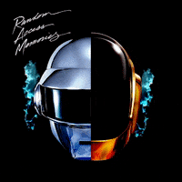
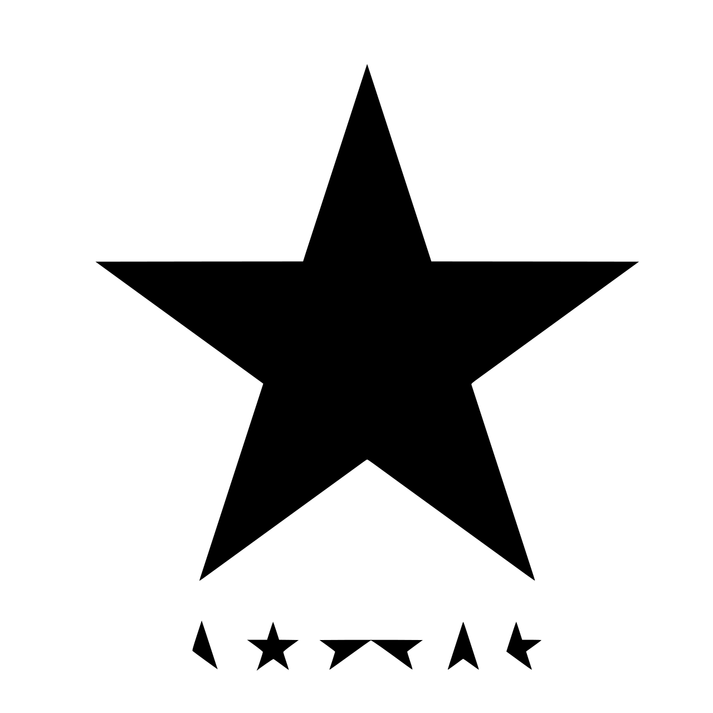
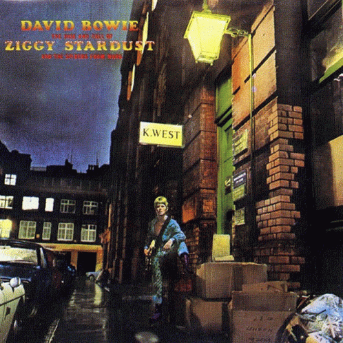
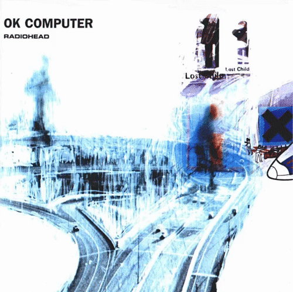

  <picture>
    
  </picture>

# Hi, I am Mayank 👋

  
  
  
  
  
  
<!--    -->

I am currently a CS graduate student at <a href="https://cims.nyu.edu/">NYU Courant</a> and lives in New Jersey. Professionally pursued Software Development at <a href="https://www.adobe.com/">Adobe</a> for 2.5 years prior to coming to US. Passionate about designing and building large scale complex systems. Currently building an extension for policy control in <a href="https://duckdb.org/">DuckDB</a> Database System. Let's connect on <a href="discordapp.com/users/991229410525073428">Discord 💬</a>

## And I love Technology, Music and Anime
### Technologies I have worked in

    <picture>
      
    </picture>
    <picture>
    
        </picture>
    <picture>
      
    </picture>
    <picture>
      
    </picture>
    <picture>
      
    </picture>
    <picture>
      
    </picture>
    <picture>
      
    </picture>
    <picture>
      
    </picture>
    <picture>
      
    </picture>
    <picture>
      
    </picture>
    <picture>
      
    </picture>
    <picture>
      
    </picture>
    <picture>
      
    </picture>
    <picture>
      
    </picture>
    <picture>
      
        </picture>
    <picture>
      
    </picture>
    <picture>
      
    </picture>
    <picture>
      
    </picture>
    <picture>
      
    </picture>
    <picture>
      
    </picture>
    <picture>
      
    </picture>
    <picture>
      
    </picture>
    <picture>
      
    </picture>
    <picture>
      
    </picture>
    <picture>
      
    </picture>
    <picture>
      
    </picture>

### My favourite albums of all time

  
  
  
  
  
  
  
  
  
  
  
  <!--  -->

### My favourite animes of all time

  
  
  
  
  
  
  
  
  
  
  

<!--
**meliodas137/meliodas137** is a ✨ _special_ ✨ repository because its `README.md` (this file) appears on your GitHub profile.

Here are some ideas to get you started:

- 🔭 I’m currently working on ...
- 🌱 I’m currently learning ...
- 👯 I’m looking to collaborate on ...
- 🤔 I’m looking for help with ...
- 💬 Ask me about ...
- 📫 How to reach me: ...
- 😄 Pronouns: ...
- ⚡ Fun fact: ...
-->
